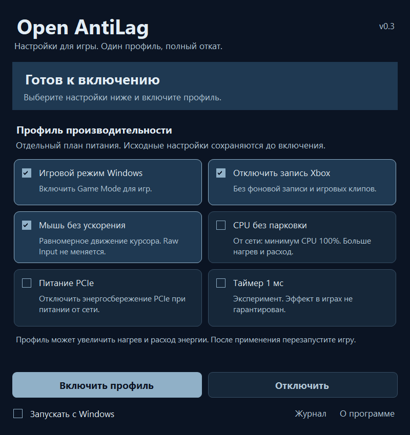

# Open AntiLag 0.3.0
[Скачать EXE](https://github.com/dw1rf/OpenAntiLag/releases/latest) · [Релизы](https://github.com/dw1rf/OpenAntiLag/releases) · [MIT](LICENSE)

## Новый интерфейс 0.3

Сине-серая палитра, тёмная системная рамка Windows, читаемые отключённые элементы и перенос описаний. Размер окна можно менять; при нехватке места настройки прокручиваются, а основные кнопки остаются доступны. Поведение профиля 0.2 сохранено.



Изображение показывает клиентскую область окна. Цвет системного заголовка задаётся через DWM; расширенные параметры рамки доступны на Windows 11. На старых версиях Windows оформление рамки зависит от поддержки системы.

Независимый менеджер игрового профиля для Windows 10/11 x64. C# / WinForms / .NET Framework 4.8. Исходники под MIT; без сторонних библиотек, драйверов, телеметрии и установщика.

## Быстрый запуск

1. Завершите старый Open AntiLag через значок в трее → «Выход».
2. Откройте `dist/OpenAntiLag.exe` из этой папки.
3. Проверьте выбранные пункты и нажмите **Enable**. Все отмеченные настройки применятся одной кнопкой, без перезагрузки ПК. Перед применением закройте игру; затем запустите её снова.
4. **Disable** восстановит значения, сохранённые перед включением. Сначала отключите профиль, чтобы поменять набор опций.

Первый запуск ничего не применяет. По умолчанию отмечены Game Mode, отключение записи Xbox и отключение ускорения мыши. Они изменяются только после Enable. Профиль повышает расход энергии; отключение ускорения меняет ощущение курсора, а отключение Game DVR лишает записи клипов Xbox. Эти опции можно снять до включения.

Автозапуск включается отдельной галочкой. После перемещения EXE включите его из нового расположения. Закрытие окна сворачивает в трей. Выход оставляет постоянные настройки применёнными, но прекращает запрос таймера.

## Настройки профиля

| Настройка | По умолчанию | Что именно меняется |
|---|---|---|
| Высокая производительность | Всегда | Создаёт и активирует отдельную копию штатного плана High Performance. Исходный план не редактируется. |
| Game Mode | Включено | `HKCU\Software\Microsoft\GameBar\AutoGameModeEnabled = 1`. |
| Отключить запись Xbox | Включено | `HistoricalCaptureEnabled` и `AppCaptureEnabled` в `HKCU\Software\Microsoft\Windows\CurrentVersion\GameDVR`, а также `GameDVR_Enabled` в `HKCU\System\GameConfigStore` устанавливаются в 0. Отключается в том числе ручная запись Xbox; OBS не настраивается. |
| Мышь без ускорения | Включено | `SPI_SETMOUSE` задаёт пороги/ускорение `[0,0,0]`. Значения до изменения сохраняются через `SPI_GETMOUSE`. Скорость указателя, DPI и частота опроса не меняются. Игры с Raw Input обходят это преобразование. |
| CPU без парковки | Выключено | В собственной схеме, только при питании от сети: `PROCTHROTTLEMIN = 100`, `PROCTHROTTLEMAX = 100`, `CPMINCORES = 100`. Это запрос политик Windows, не гарантия фиксированной частоты или поведения firmware. |
| PCIe без энергосбережения | Выключено | В собственной схеме, только от сети: `SUB_PCIEXPRESS / ASPM = 0`. |
| Таймер 1 мс | Выключено | `timeBeginPeriod(1)` до Disable/выхода. Экспериментальная опция, не глобальный ускоритель игр на современных Windows. |

Дополнительные изменения CPU/PCIe относятся к питанию от сети. Базовая копия High Performance также содержит собственные штатные параметры для батареи. Режим CPU 100% может увеличить нагрев, расход и даже ухудшить производительность при перегреве. Профиль не гарантирует больше FPS, меньшую задержку или отсутствие статтеров. Измеряйте результат в своей игре.

## Откат и совместимость

- Перед изменениями сохраняются GUID исходного плана и точные исходные значения каждого выбранного параметра. Сохраняется и отсутствие значения реестра: при откате оно удаляется, а не подменяется «значением по умолчанию».
- Перед каждой записью сохраняется отметка о попытке. При сбое выполняется обратный откат. Если он не завершён, доступна кнопка «Восстановить».
- Если настройку после Enable изменили извне, Disable сохраняет внешний выбор. Состояние окна сообщает об обнаруженном расхождении. Идентичное целевому значению внешнее изменение невозможно отличить от значения приложения.
- При ошибке восстановления отдельного параметра программа продолжает восстановление остальных параметров и питания, сохраняя журнал для повторной попытки.
- Ошибочный тип значения реестра блокирует применение вместо потери данных. Произвольные пути реестра из XML не принимаются: доступен только фиксированный список параметров.
- Штатные ограничения Windows не обходятся. Если политика или Modern Standby запрещают план, программа покажет ошибку и попробует откат.
- Запись настроек Game DVR проверяется чтением реестра. Эти параметры зависят от сборки Windows и не являются стабильным публичным API управления кодировщиком. Приложение не гарантирует остановку уже запущенной записи: остановите запись, закройте игру/Game Bar и проверьте «Параметры → Игры → Записи».
- Никаких изменений BCD, HPET, HAGS, сетевого стека, антивируса, служб или системных файлов. NVIDIA Reflex / AMD Anti-Lag настраиваются отдельно в поддерживающей их игре/драйвере.

## Обновление с 0.1 / 0.2

0.3 читает состояние 0.1 и 0.2 и умеет восстановить план 0.1. Если старый профиль активен, сначала нажмите Disable в новой версии, затем Enable с нужными опциями. Новая версия использует тот же одиночный экземпляр: пока старая копия работает, новая не запустится.

**После применения профиля 0.2/0.3 не запускайте 0.1 до полного отката в новой версии:** старая версия не знает о новых резервных копиях. Если автозапуск указывал на старый EXE, включите галочку автозапуска из новой версии, чтобы обновить путь. Сохранённый архив 0.1 остаётся отдельной предыдущей сборкой.

68W AntiLag тоже нужно закрыть перед Enable. Его ранее применённые изменения не отменяются. Например, если исходным планом был «AntiLag Supreme Performance», Disable вернёт именно его, а не Balanced.

## Данные и удаление

Данные находятся в `%LOCALAPPDATA%\OpenAntiLag`: `state.xml`, предыдущая версия `state.xml.bak`, журнал `events.log`. Журнал и резервные копии локальные. Повреждённое состояние не заменяется пустым: запуск останавливается с сообщением.

Перед удалением нажмите Disable, выключите автозапуск и выйдите через трей. Не удаляйте `state.xml` при активном профиле: он нужен для восстановления. Если исходный план удалён извне, выберите другой план в Windows и повторите восстановление.

## Сборка и проверка

```powershell
.\build.ps1
```

Используется встроенный компилятор .NET Framework. Сборка запускает 27 тестов с имитацией Windows: жизненный цикл, частичный сбой каждой настройки, откат, внешние изменения, повторная попытка, отказ записи, сохранение отсутствующих значений и старый формат XML. Реальные оптимизации во время тестов не включаются.

```powershell
# Только чтение параметров Windows, без изменения системы
.\dist\OpenAntiLag.Tests.exe --inspect

# Рендер окна с имитацией Windows
.\dist\OpenAntiLag.Tests.exe --preview "$PWD\preview.png"
```

Проверены сборка, тесты, рендер окна и чтение настоящих настроек Windows. Применение профиля к реальному ПК, автозапуск после входа и эффект в играх автоматически не проверялись. EXE не имеет цифровой подписи; можно пересобрать из приложенных исходников.

## Структура

- `src/Settings.cs` — опции и фиксированный список параметров.
- `src/Engine.cs` — резервные копии, транзакции и восстановление.
- `src/WindowsHost.cs` — адаптер Windows, powercfg, мышь, реестр, таймер, автозапуск.
- `src/MainForm.cs` — окно и трей.
- `src/Program.cs` — запуск и журнал.
- `tests/Tests.cs` — имитация Windows и проверки отказов.

## Источники

- [Microsoft: Game Mode и значения настроек Windows](https://learn.microsoft.com/en-us/windows/apps/develop/settings/settings-windows-11)
- [Microsoft: SystemParametersInfo](https://learn.microsoft.com/en-us/windows/win32/api/winuser/nf-winuser-systemparametersinfow)
- [Microsoft: Powercfg](https://learn.microsoft.com/en-us/windows-hardware/design/device-experiences/powercfg-command-line-options)
- [Microsoft: timeBeginPeriod и ограничения](https://learn.microsoft.com/en-us/windows/win32/api/timeapi/nf-timeapi-timebeginperiod)
- [OBS: игровые функции Windows и фоновая запись](https://obsproject.com/kb/windows-gaming-features-troubleshooting)

Самостоятельная реализация, не связанная с 68Whiskey и авторами других оптимизаторов. Лицензия [MIT](LICENSE).

