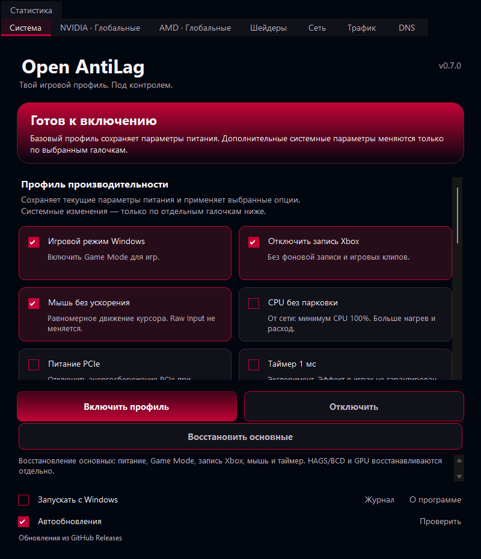

# Open AntiLag 0.6.2

[Скачать EXE](https://github.com/dw1rf/OpenAntiLag/releases/latest) · [MIT](LICENSE)

Открытый менеджер обратимого игрового профиля для Windows 10/11 x64 и .NET Framework 4.8. Без собственного драйвера и телеметрии.

**В 0.6.1 HAGS, BCD и системные приоритеты доступны отдельными галочками, выключенными по умолчанию.** Базовый профиль копирует текущий план питания, сохраняя его параметры от сети и батареи, вместо принудительного High Performance. Это снижение риска, а не гарантия отсутствия сбоев на любом ПК. Прирост FPS и уменьшение задержки не гарантируются.

**В 0.6.2 исправлен цикл автообновления версии 0.6.1.** Обновлятор берёт текущую версию из сборки приложения и повторно проверяет, что файл новее установленного, перед запуском помощника и заменой EXE.



## Подготовка шейдеров — новое в 0.6.0

Вкладка **«Шейдеры»** использует официальный отдельный движок [SCSKiller 1.2.5](https://github.com/BlueHeisenberg/SCSKiller). Это интеграция части его возможностей: поиск игр, состояние шейдеров и устаревшего кэша, последовательная подготовка выбранных поддерживаемых игр, остановка и чтение размера кэша драйвера.

1. Запустите Open AntiLag без прав администратора. Откройте «Шейдеры» → **«Загрузить модуль»**. Загрузка около 120 МБ; после распаковки и создания кэша потребуется дополнительное место.
2. Нажмите **«Найти игры»**. Первый анализ файлов может занять несколько минут.
3. Закройте игру, выберите одну или несколько игр со статусом готовности и нажмите **«Подготовить»**. Дождитесь завершения. «Остановить» ожидает штатного завершения текущих операций движка.

Модуль запускается только по кнопке, с низким приоритетом и максимум 4 потоками; бюджет памяти компилятора — 2 ГБ (это не жёсткий предел памяти всех процессов и драйвера). Он создаёт кэш через графический драйвер, поэтому возможны нагрузка, нагрев и расход места. Подготовка не гарантирует устранение всех подёргиваний.

Нужны Windows 10 2004+ / Windows 11 x64 и поддерживаемая NVIDIA или AMD. Поддержка зависит от игры, API и драйвера. **CS2 в проверенном SCSKiller 1.2.5 не поддерживается.** Игры со статусом «Нужна запись игры» также недоступны: рекордер, установка DLL в папки игр и офлайн-режимы для античита в этой интеграции отключены. Очистка кэша, изменение его лимита, автозапуск подготовки и автоматическая подготовка после обновления драйвера не добавлены.

Модуль загружается отдельно с GitHub по закреплённой версии и SHA-256. Он использует изолированные данные в `%LOCALAPPDATA%\OpenAntiLag\shader-engine\1.2.5`; профиль отдельно установленного SCSKiller не импортируется. Перед запуском проверяются файлы движка и ограничения настроек. Самостоятельно не запускайте GUI и не меняйте настройки внутри этой папки. При повреждении модуль останавливается с ошибкой; переустановка поверх существующих данных запрещена. Для повторной установки закройте приложение и переименуйте эту папку, сохранив её как резервную копию.

SCSKiller распространяется по GPL-3.0-or-later с исключениями для отдельных компонентов. Его исходники не включены в код Open AntiLag; оригинальные лицензии сохраняются в отдельно загруженном дистрибутиве. Модуль может обращаться к сети за правилами совместимости и вспомогательными кодеками; обмен пользовательскими записями и community-база отключены. [Устройство интеграции и ограничения](docs/shader-integration.md).


## Обновление с 0.5.6 и старее

Обновление сохраняет все резервные копии и не меняет настройки Windows автоматически. Если старый профиль активен или восстановление не завершено, приложение показывает «Восстановите старый профиль» и блокирует новое включение.

1. Нажмите **«Восстановить»**. Для старой системной части подтвердите UAC под той же учётной записью.
2. Если показано требование перезагрузки, сохраните работу и перезагрузите ПК. До этого новый профиль недоступен.
3. Включите новый профиль. Дополнительные опции CPU, PCIe и таймер после восстановления сброшены в выключенное состояние.

Старый временный таймер не возобновляется при запуске 0.5.7. Постоянные старые настройки сохраняются до явного восстановления. Резервные копии NVIDIA/AMD восстанавливаются отдельными кнопками на соответствующих вкладках.

Не удаляйте журналы при активном профиле. Перед возвратом к старой версии сначала отключите профиль в 0.5.7: новая пользовательская схема состояния имеет версию 3 и намеренно не принимается прежними версиями.

## Что делает основная кнопка

Создаёт отдельную копию **текущего** плана питания, сохраняет его исходный идентификатор, применяет выбранные опции и включает копию. Без дополнительных опций CPU/PCIe параметры питания остаются исходными. Если план уже был изменён другой утилитой, эти параметры тоже копируются: приложение не возвращает заводские настройки Windows.

| Опция | По умолчанию | Изменение |
|---|---|---|
| Game Mode | Да | `HKCU\Software\Microsoft\GameBar\AutoGameModeEnabled = 1`. |
| Отключить запись Xbox | Да | `HistoricalCaptureEnabled`, `AppCaptureEnabled`, `GameDVR_Enabled` → 0; отключается в том числе ручная запись Xbox. OBS не настраивается. |
| Мышь без ускорения | Да | `SPI_SETMOUSE` → `[0,0,0]`. DPI, скорость и частота опроса не меняются. Raw Input не затрагивается. |
| CPU без парковки | Нет | В копии плана только от сети: минимум/максимум CPU 100%, `CPMINCORES=100`. Может повысить нагрев и расход. |
| Питание PCIe | Нет | В копии плана только от сети: `ASPM=0`. Может повысить энергопотребление. |
| Таймер 1 мс | Нет | `timeBeginPeriod(1)` на время работы приложения с активным профилем. Не гарантирует таймер 1 мс в игре. |

Без дополнительных системных галочек профиль не записывает BCD, `HwSchMode` или `Win32PrioritySeparation` и не запрашивает UAC. Защита Windows и устройство HPET не отключаются. Старый служебный вызов включения сразу всех системных параметров заблокирован.

### Отдельные системные галочки

Ниже базовых опций на вкладке «Система» находятся пять независимых галочек. Они применяются кнопкой «Включить профиль». Невыбранные системные параметры не читаются и не меняются. UAC требуется только при выбранных системных опциях; после изменения и восстановления нужна перезагрузка. Отмена UAC не применяет пользовательский профиль.

| Галочка | Записываемое значение |
|---|---|
| Включить HAGS | `HwSchMode=2`. Требует Windows 10 2004+ и поддержки GPU/драйвера. Успешная запись не доказывает аппаратную активацию. |
| Приоритет активных приложений | `Win32PrioritySeparation=42` (`0x2A`). |
| BCD: автоматический источник часов | Удаляет принудительный `useplatformclock`, возвращая выбор Windows. |
| BCD: платформенный тик | `useplatformtick=yes`. |
| BCD: отключить динамический тик | `disabledynamictick=yes`. |

BCD-параметры предназначены для отладки и могут вызвать проблемы работы или загрузки; ускорение не гарантируется ([Microsoft BCDEdit](https://learn.microsoft.com/en-us/windows-hardware/drivers/devtest/bcdedit--set)). HAGS поддерживается не каждым GPU/драйвером ([Microsoft HAGS](https://devblogs.microsoft.com/directx/hardware-accelerated-gpu-scheduling/)). При активной или неизвестной защите BitLocker выбранные изменения BCD не применяются. HAGS/приоритет сами по себе не обращаются к BCD/провайдеру BitLocker.

Сначала сохраняются исходные значения выбранных параметров, включая отсутствие. При ошибке выполняется попытка отката; отличающиеся внешние изменения сохраняются. «Отключить» восстанавливает профиль, включая системную часть. Перед возвратом на 0.6.0 или старее сначала восстановите системные опции в 0.6.1: старые версии не читают новый системный журнал версии 2.


## Запуск и совместимость

Запустите EXE из постоянной доступной для записи папки. Закройте игру, выберите опции и нажмите «Включить профиль». «Отключить» восстанавливает сохранённые значения. Закрытие окна сворачивает его в трей. Выход завершает временный таймер, но оставляет постоянные настройки. Автозапуск включается отдельно; после перемещения EXE обновите его из нового расположения.

Целевая платформа — Windows 10/11 x64. Совместимость со всеми сборками, драйверами и оборудованием не проверена. Урезанные сборки, Modern Standby и корпоративные политики могут запрещать копирование или переключение планов. В таком случае операция завершается ошибкой с попыткой отката; ограничения не обходятся. Без выбранных BCD-опций WMI-провайдер BitLocker не нужен. WMI используется для BCD и определения загрузочной сессии при системных изменениях и восстановлении.

## Восстановление

До записи сохраняются исходные значения, включая отсутствие параметра. Запись проверяется чтением. Ошибка пользовательского применения вызывает попытку отката; незавершённое восстановление можно повторить. Внешние изменения, отличающиеся от применённых программой, сохраняются. Идентичную стороннюю запись отличить невозможно.

Пользовательские журналы: `%LOCALAPPDATA%\OpenAntiLag\state.xml`, `state.xml.bak`, `events.log`. Системный журнал: `HKLM\SOFTWARE\OpenAntiLag\SystemProfile`, значение `Journal`. Он хранит выбранные опции и исходные значения, привязан к пользователю; при наличии BCD также к записи загрузчика. При активной или неизвестной защите BitLocker восстановление BCD блокируется, другие настройки восстанавливаются по возможности, журнал сохраняется. Программа не отключает BitLocker или Secure Boot.

Откат в приложении требует работающей Windows и не является аварийным восстановлением незагружающегося ПК. Если исходный план питания удалён извне, выберите другой план Windows и повторите восстановление. Перед удалением приложения отключите профиль, восстановите отдельно применённые GPU-настройки, при необходимости перезагрузите ПК, отключите автозапуск и выйдите через трей.

## NVIDIA и AMD

Чтение NVIDIA/AMD начинается только по кнопке «Прочитать», открытие вкладки не запускает скрытую операцию. Отдельные вкладки применяют глобальные настройки драйвера только по своей кнопке; основная кнопка системы их не применяет. Исходные значения сохраняются, доступны отдельные кнопки восстановления. Разгон, напряжения и прошивки не меняются.

Эти функции не стали проверенными на всех драйверах в 0.5.7. NVIDIA использует в том числе недокументированные функции; постоянное сохранение и эффект в играх на реальном оборудовании не подтверждены имеющимися проверками. AMD остаётся экспериментальной и не проверена на настоящей Radeon. Подробности: [NVIDIA](docs/nvidia-implementation.md), [AMD](docs/amd-implementation.md).

## Автообновления

Включены по умолчанию. При запуске и каждые 6 часов программа проверяет GitHub Releases репозитория `dw1rf/OpenAntiLag`; кнопка «Проверить» работает и при отключённой автоматической проверке. Принимаются новые обычные релизы `vX.Y.Z` с `OpenAntiLag.exe`. Проверяются URL, размер до 32 МБ, SHA-256 из GitHub API, имя и версия сборки. EXE не подписан; SHA-256 не заменяет подпись издателя. Доверие остаётся у репозитория и HTTPS.

Обновление скачивается в фоне, приложение автоматически перезапускается после завершения текущей операции. Применение и восстановление не прерываются. Старый EXE сохраняется рядом как `.previous`; при ошибке запуска возвращается обратно. Обнаружение сбоя уже запущенной версии не реализовано. Настройки и резервные копии профиля не меняются. После обновления старый профиль требует явного восстановления по инструкции выше.

Нужна доступная для записи папка и обычный запуск без прав администратора. Ошибки пишутся в `events.log`; загрузки — в `%LOCALAPPDATA%\OpenAntiLag\updates`; отключение проверки — в `updates.disabled`. Сведения о настройках ПК не отправляются.

## Проверка и сборка

```powershell
./build.ps1
./dist/OpenAntiLag.Tests.exe --ui-check
./dist/OpenAntiLag.Tests.exe --inspect
```

120 автоматических тестов с подменой Windows/драйверов: все 32 сочетания системных опций, выборочное применение и восстановление, отмена UAC, совместимость журналов, точный откат старых BCD/HAGS/приоритетов, BitLocker, частичные ошибки, внешние изменения, таймер, обновление EXE и GPU-профили. UI-проверка проверяет реальные кнопки на имитации, переход со старого профиля, блокировку до перезагрузки и сброс агрессивных опций. `--inspect` только читает настройки настоящей Windows. Дополнительно проверены защита распаковки, целостность модуля, протокол очереди, отмена и завершение дочерних процессов, а также новая вкладка на имитации. Официальный модуль прошёл проверку запуска и реальный поиск 10 игр на NVIDIA RTX 4070 Ti; полная подготовка шейдеров настоящей игры и оборудование AMD не проверялись.

Реальная запись BCD/HAGS/приоритетов, перезагрузка после применения/отката и эффект в играх не проверялись. UI-проверки дополнительно подтверждают видимость выделенной игры после ухода фокуса и отсутствие блокировки GPU-вкладок во время фонового чтения профиля. Гарантии отсутствия BSOD на любых сборках Windows нет.

Самостоятельная реализация, не связанная с 68Whiskey / AmbitiousPilots.